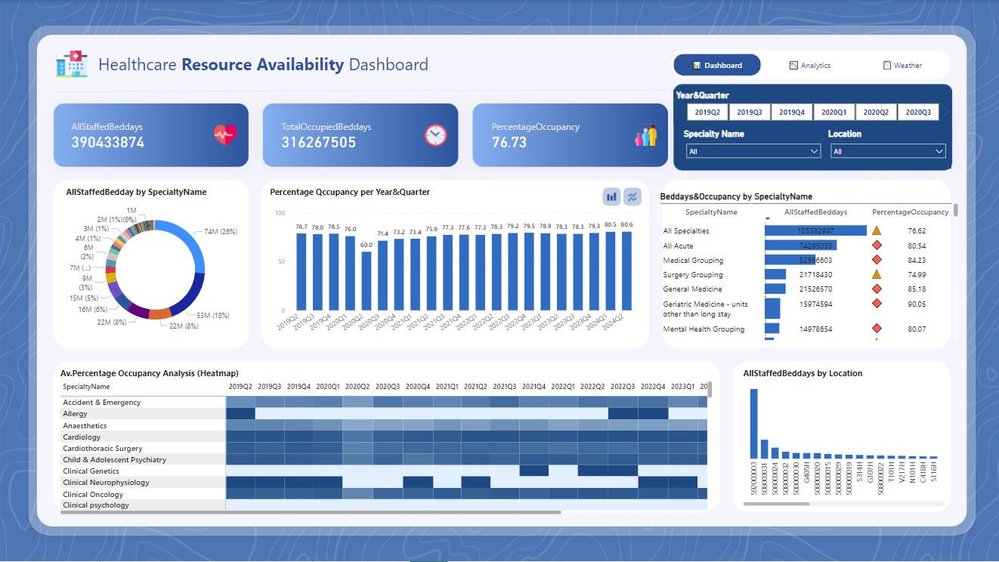
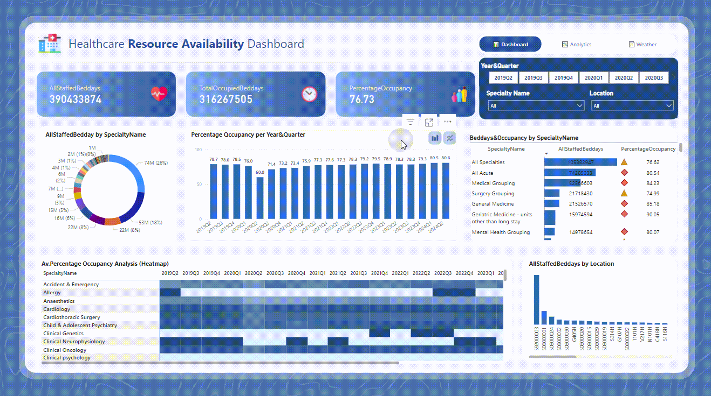
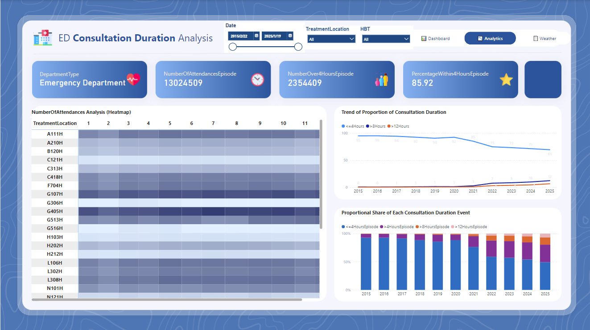
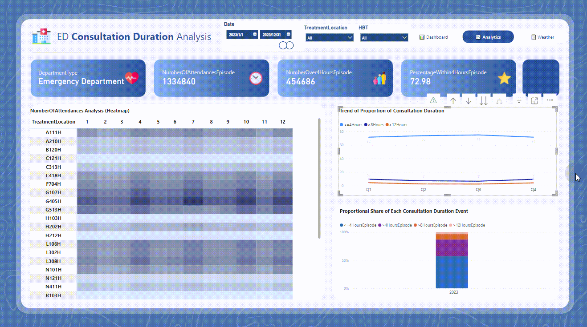
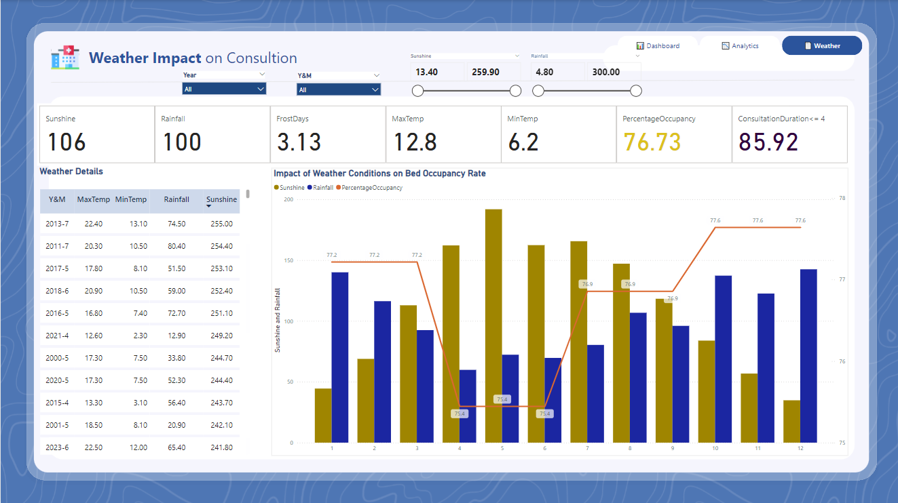
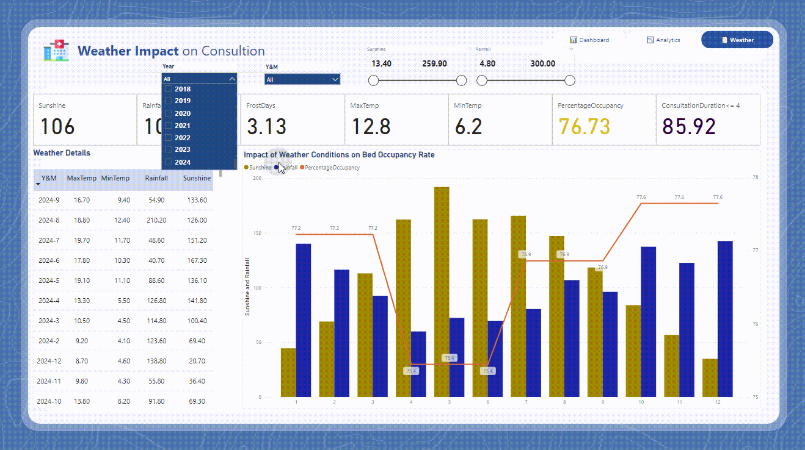

# NHS Scotland Healthcare Data Analysis

## Project Overview
This Power BI-based interactive dashboard provides an in-depth analysis of NHS Scotland’s healthcare system, focusing on key insights such as:

- **Hospital resource allocation**: Bed occupancy rates across hospitals.
- **A&E waiting time analysis**: Trends in emergency department waiting times.
- **Weather impact on consultations**: The correlation between weather patterns and hospital visits.

The dashboard is designed to be fully interactive, allowing users to explore healthcare trends, filter data dynamically, and gain valuable insights for resource planning.

---

## Key Features

### 1. Hospital Resource Allocation 📊
- Visualizes bed occupancy rates across hospitals.
- Helps healthcare administrators allocate resources more efficiently.

### 2. A&E Waiting Time Analysis ⏳
- Tracks emergency department waiting times across Scotland.
- Offers insights into peak consultation periods and resource demands.

### 3. Weather Impact on Consultations 🌦️
- Analyzes how weather patterns (e.g., rainy days) correlate with increased A&E visits.
- Suggests potential links between climate conditions and emergency healthcare demand.

---

## Interactive Dashboards 🎛️

📌 Below are previews of the interactive dashboards. Click on the images to explore the full experience!

### **1️⃣ Hospital Resource Allocation Dashboard**
#### **📊 Static Image**

#### **🎬 GIF Preview**

---

### **2️⃣ A&E Waiting Time Analysis**
#### **📊 Static Image**

#### **🎬 GIF Preview**

---

### **3️⃣ Weather Impact on Consultations**
#### **📊 Static Image**

#### **🎬 GIF Preview**

---

## Project Goals 🎯
- **Design interactive dashboards** for healthcare resource monitoring.
- **Predict peak consultation periods** based on historical data.
- **Provide early warnings** for potential surges in patient visits.

---

## Datasets Used 📊
- **A&E Waiting Times:** [Dataset Link](https://www.opendata.nhs.scot/dataset/accident-emergency-waiting-times)
- **Hospital Beds Capacity:** [Dataset Link](https://www.opendata.nhs.scot/dataset/hospital-beds)
- **Scottish Weather Historical Data:** [Dataset Link](https://www.metoffice.gov.uk/research/climate/maps-and-data/historic-station-data)
- The weather data is collected from the **Paisley weather station**, as it is located near Glasgow, where I live. This station serves as a representative source for analyzing local weather impact on healthcare trends.

---

## Insights & Discussion 💡
- Why do you think rainy days increase healthcare demand? Have you noticed similar trends in your own data projects?
- Do you prefer **Power BI** or **Tableau** for interactive dashboards? I’d love to hear your thoughts!

---

## Acknowledgments
This project leverages NHS Scotland public datasets for educational and analytical purposes. Special thanks to Power BI for providing an excellent platform for interactive visualizations.
